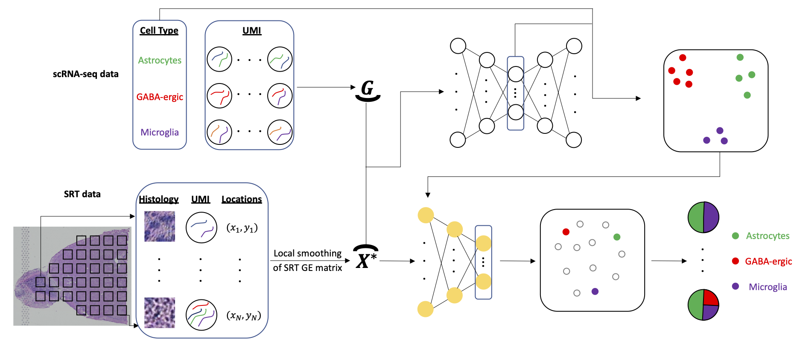

# SpaDecon: cell-type deconvolution in spatial transcriptomics with transfer learning

### Kyle Coleman, Jian Hu, Amelia Schroeder, Edward B. Lee, Mingyao Li*

SpaDecon is a transfer learning-based method developed to perform cell-type deconvolution on spatially resolved transcriptomics (SRT) datasets.

A markdown tutorial file can be found here: https://github.com/kpcoleman/SpaDecon/blob/main/tutorial/Tutorial.md

A tutorial in the form of a jupyter notebook can be found here: https://github.com/kpcoleman/SpaDecon/blob/main/tutorial/tutorial.ipynb

